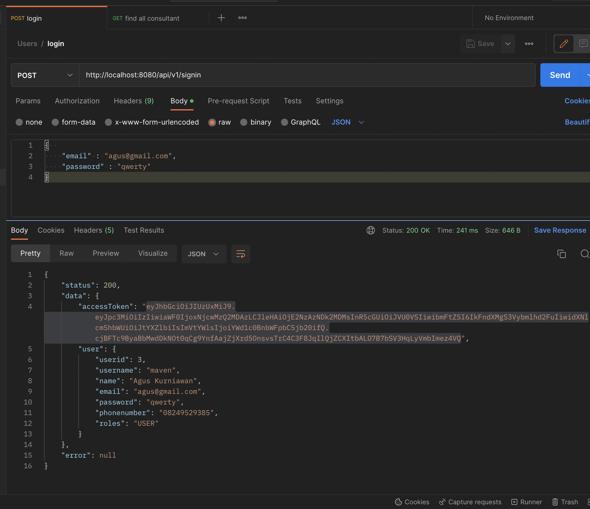

## **SPRING JSON WEB TOKEN -- GEETOOR MAVEN --**

##### -- folder entity : menyimpan semua isi table yang akan di masukan natinya di dalam database kita, cth(id, nama, password)

##### -- folder repo : mewariskan class CrudJpa agar fungsi yang ada di dalamnya dapat di pakai. cth(save(user), findById(id))

##### -- folder service : semua logic kita ada di service seperti mengecek apakah username yang ada di table sama dengan username sekarang yang di masukan

##### -- folder controller : endpoint api kita ada semua di dalam folder ini. cth("/api/v1/register")

##### -- folder util : biasanya di sebut dengan utility (di java) di mana folder ini menyimpan class untuk membantu kita membuat tokennya (lihat aja di JwtUtils.java) udah ada komennya di sana

##### -- folder config : terdapat dua class di dalam folder itu, yang di mana ketika user mengakses api selain login register, akan access danied kalau belum melakukan render token (harus login dulu )

##### -- folder dto(data transfer object) : folder untuk menyimpan data kita sebelum di kirim kan ke entity, jadi alih alih kita tidak langsung menginject data data yang ada di dalam tabel sebelum melewati class DTO nya trlebih dahulu

### Berikut output ketika melakukan pengambilan token (user login) : 

### berikut ketika user  mengambil data, tapi harus memasukan tokennya terlebih dahulu : 

### by : geetoor maven (Agus Kurniawan anak JDT)